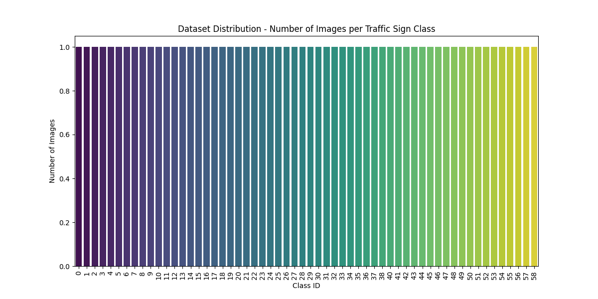
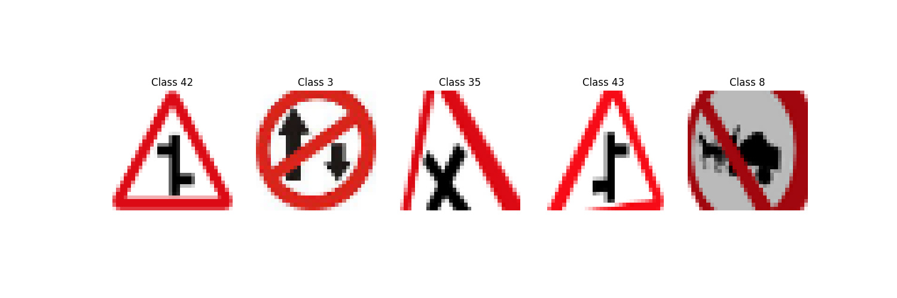
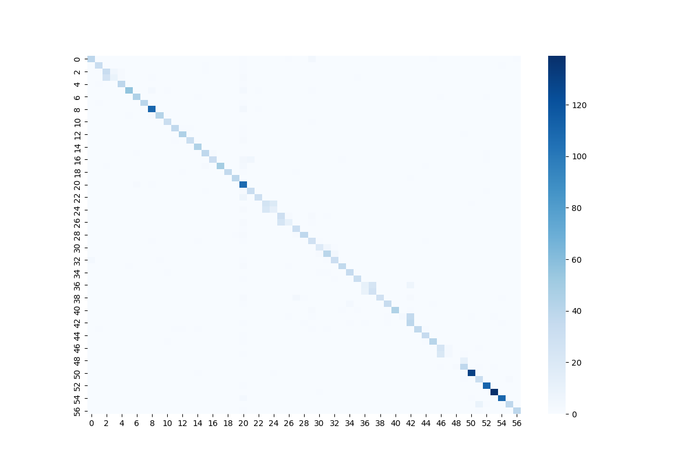

# Traffic Sign Recognition System

## Project Overview
- Develop a CNN-based Traffic Sign Classifier for ADAS applications.
- Dataset contains 58 classes of Indian traffic signs.
- Model is trained using TensorFlow/Keras.

## Repository Structure
```
Traffic_Sign_Recognition_Repo/
├── data/
├── src/
├── notebooks/
├── models/
├── results/
├── visualizations/
├── reports/
├── README.md  # Project documentation
```

## Progress Log

### 📌 Dataset Analysis Completed
- Total Classes: 58
- Total Images: 13971
- 
- 
- [Dataset Report](reports/dataset_report.txt)

### 📌 Model Training Completed
- Validation Accuracy: 84.65%
- 
- [Classification Report](results/classification_report.csv)
- [Trained Model](models/traffic_sign_model.h5)

### 📌 Model Deployment Completed
- 🚀 **Live Web App**: [Click here](https://huggingface.co/spaces/vishnupv123/traffic-sign-recognition?logs=container)
- [Deployment Script](notebooks/Deployment.ipynb)
